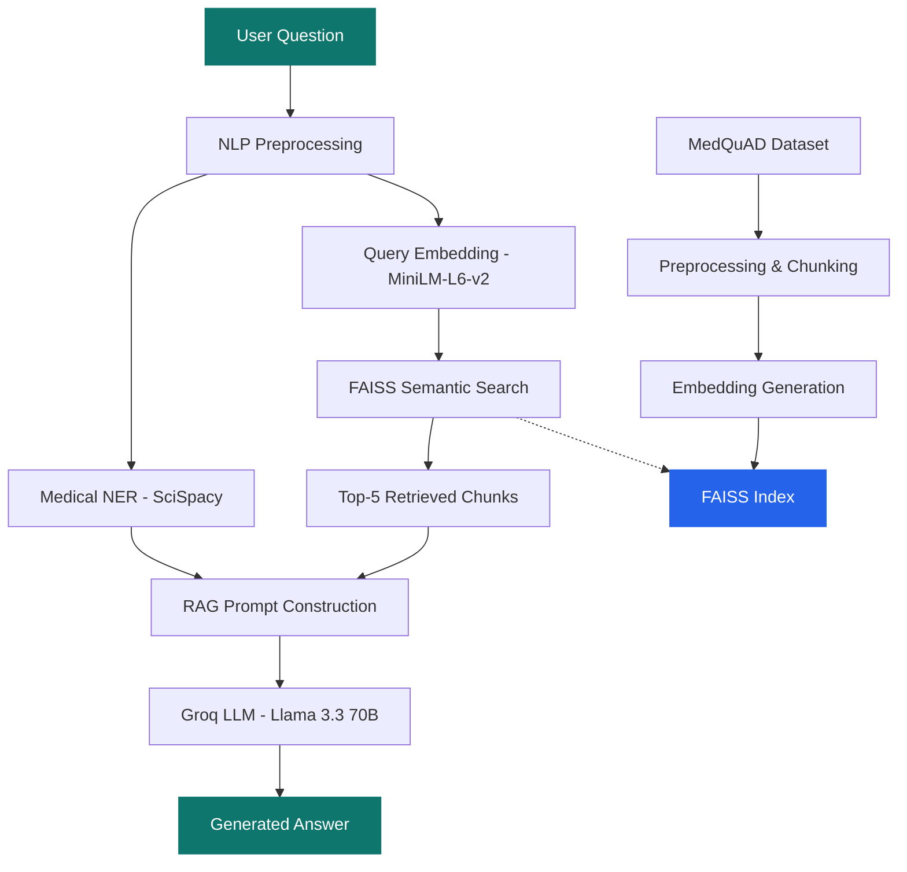

# 🏥 MedAssist AI — Medical NLP Chatbot

> Intelligent Medical Question Answering using Medical NER, Semantic Search, Retrieval-Augmented Generation (RAG), and Large Language Models.

[](https://python.org)
[](https://streamlit.io)
[](https://github.com/facebookresearch/faiss)
[](https://groq.com)

---

## 🎯 Overview

MedAssist AI is a production-quality medical chatbot that answers user medical questions by:

1. **Extracting Medical Entities** (Diseases, Symptoms, Drugs, Anatomy) using SciSpacy NER
2. **Searching** a FAISS vector database of 16,000+ medical QA pairs from the MedQuAD dataset
3. **Retrieving** the top-5 most relevant knowledge chunks via semantic similarity
4. **Generating** grounded answers using Groq-hosted Llama 3.3 70B via RAG

The system **never hallucinate** — all responses are strictly grounded in retrieved medical literature.

---

## 🏗️ Architecture



---

## ✨ Features

| Feature | Technology |
|---|---|
| NLP Preprocessing | spaCy — tokenization, lemmatization, normalization |
| Medical NER | SciSpacy (`en_core_sci_sm`) — UMLS entity extraction |
| Embeddings | `sentence-transformers/all-MiniLM-L6-v2` (384d) |
| Vector Database | FAISS `IndexFlatIP` with cosine similarity |
| LLM Inference | Groq LPU — Llama 3.3 70B Versatile |
| RAG Pipeline | Context-grounded prompt with source citations |
| Frontend | Streamlit with custom-styled UI |
| Evaluation | Precision@K, Recall@K, Similarity Scores, Response Time |

---

## 📁 Project Structure

```
MedAssistAI/
├── medquad.csv                      # MedQuAD dataset (16,412 QA pairs)
├── pyproject.toml                   # uv project configuration
├── requirements.txt                 # pip-compatible dependencies
├── config.yaml                      # Central configuration
├── .env.example                     # Environment variable template
├── README.md                        # This file
│
├── medical_chatbot/                 # Core library
│   ├── data/loader.py               # Dataset loading & validation
│   ├── preprocessing/text_processor.py  # NLP preprocessing pipeline
│   ├── ner/medical_ner.py           # Medical Named Entity Recognition
│   ├── embeddings/encoder.py        # Sentence-transformer encoder
│   ├── vector_store/faiss_store.py  # FAISS index management
│   ├── retriever/semantic_retriever.py  # Semantic search retrieval
│   ├── rag/pipeline.py              # RAG prompt construction
│   ├── llm/groq_client.py           # Groq API client
│   ├── evaluation/metrics.py        # IR evaluation metrics
│   └── utils/                       # Logger & config utilities
│
├── scripts/
│   ├── prepare_dataset.py           # Dataset preparation script
│   └── build_index.py               # FAISS indexing script
│
├── app/
│   └── streamlit_app.py             # Streamlit frontend
│
└── faiss_index/                     # Generated (gitignored)
    ├── index.faiss
    └── metadata.pkl
```

---

## 🚀 Quick Start

### Prerequisites

- Python 3.10+
- [uv](https://docs.astral.sh/uv/) package manager
- [Groq API key](https://console.groq.com/keys) (free tier available)

### 1. Clone & Setup

```bash
cd MedAssistAI

# Install dependencies (includes SciSpacy model)
uv pip install -r requirements.txt
```

### 2. Configure Environment

```bash
# Copy the example .env file
cp .env.example .env

# Edit .env and add your Groq API key
# GROQ_API_KEY=gsk_your_key_here
```

### 3. Prepare Dataset & Build Index (Optional)

> [!NOTE]
> A pre-built FAISS index is already included in `faiss_index/`. You can skip this step and go straight to launching the application. If you want to rebuild it or use a different dataset, run:

```bash
# Step 1: Clean and preprocess the dataset
uv run python scripts/prepare_dataset.py

# Step 2: Build the FAISS index (generates embeddings — takes a few minutes)
uv run python scripts/build_index.py
```

### 4. Launch the Application

```bash
uv run streamlit run app/streamlit_app.py
```

Open `http://localhost:8501` in your browser.

---

## 🌐 Deployment (Streamlit Community Cloud)

This application is optimized for easy deployment to **Streamlit Community Cloud** (no Docker required).

### 1. Repository Setup
Ensure the following files are tracked and committed to your Git repository (they are enabled by default in `.gitignore`):
- `uv.lock` (for fast, pinned dependencies using `uv`)
- `faiss_index/` (pre-built vector database assets)
- `app/streamlit_app.py` (entry point)

### 2. Streamlit Cloud Dashboard Setup
1. Connect your GitHub repository to [Streamlit Community Cloud](https://share.streamlit.io/).
2. Select your branch and set the **Main file path** to `app/streamlit_app.py`.
3. In **Advanced Settings / Secrets**, add your Groq API Key:
   ```toml
   GROQ_API_KEY = "gsk_your_key_here"
   ```
4. Click **Deploy**. Dependencies and the pre-built index will load automatically.

---

## 📊 Evaluation Metrics

The system includes built-in evaluation measuring:

| Metric | Description |
|---|---|
| **Precision@5** | Fraction of top-5 results that are relevant |
| **Recall@5** | Fraction of relevant documents retrieved in top-5 |
| **Avg Similarity** | Mean cosine similarity of retrieved chunks |
| **Avg Response Time** | End-to-end query latency |

---

## 🔧 Configuration

All settings are managed in [`config.yaml`](config.yaml):

```yaml
preprocessing:
  chunk_size: 500       # Characters per chunk
  chunk_overlap: 100    # Overlap between chunks

embeddings:
  model_name: "sentence-transformers/all-MiniLM-L6-v2"

llm:
  provider: "groq"
  model: "llama-3.3-70b-versatile"
  temperature: 0.3
```

---

## 🛡️ Error Handling

The application handles:
- ❌ Missing API key → clear error message with setup instructions
- ❌ Empty query → user-friendly warning
- ❌ No retrieval results → graceful fallback message
- ❌ Invalid dataset → validation errors with details
- ❌ FAISS loading failure → instructions to rebuild index
- ❌ API rate limits → retry guidance

---

## 🧰 Tech Stack

| Layer | Technology |
|---|---|
| Language | Python 3.10+ |
| Package Manager | uv |
| NLP | spaCy 3.7+, SciSpacy 0.5.4 |
| Embeddings | sentence-transformers (MiniLM-L6-v2) |
| Vector DB | FAISS (faiss-cpu) |
| LLM | Groq API (Llama 3.3 70B) |
| Frontend | Streamlit |
| Config | YAML + python-dotenv |

---

## ⚠️ Disclaimer

This project is for **educational and demonstration purposes only**. It is NOT a substitute for professional medical advice, diagnosis, or treatment. Always consult a qualified healthcare provider for medical concerns.

---


## 🙏 Acknowledgments

- **MedQuAD** dataset by Asma Ben Abacha & Dina Demner-Fushman (NLM/NIH)
- **SciSpacy** by AllenAI
- **FAISS** by Meta AI Research
- **Groq** for ultra-fast LPU inference
- **Sentence-Transformers** by UKPLab
